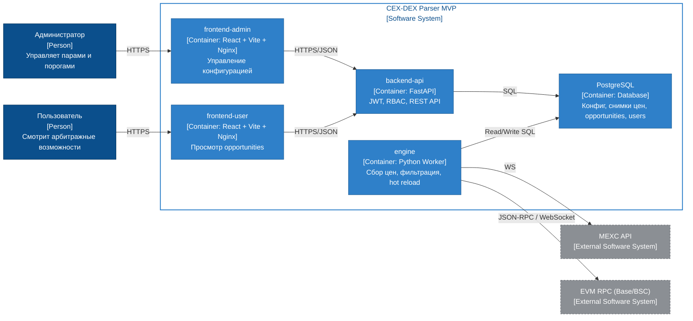
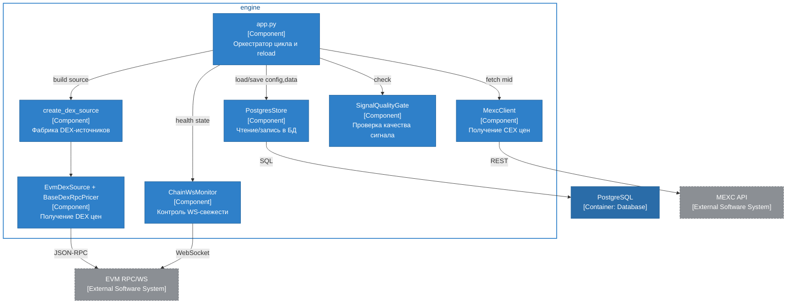
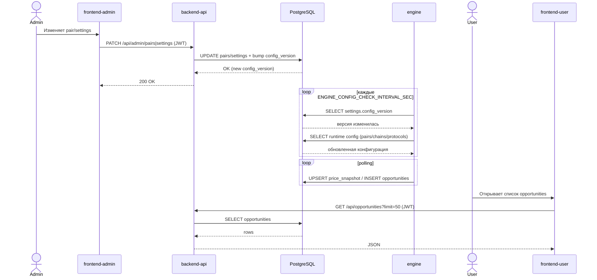
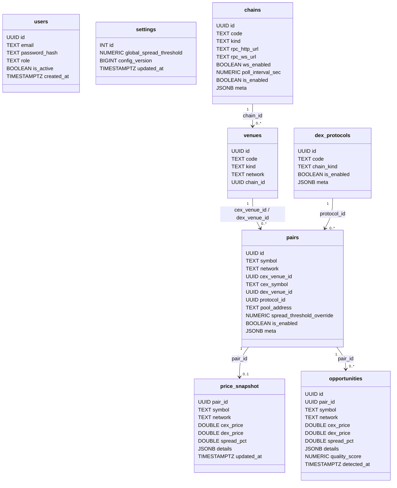

# Лабораторная работа №3

**Тема:** Использование принципов проектирования на уровне методов и классов  
**Цель работы:** Получить опыт проектирования и реализации модулей с использованием принципов KISS, YAGNI, DRY, SOLID и др.

## Выбранный вариант использования
Управление торговыми парами и порогами через admin-интерфейс с последующим `hot reload` конфигурации в `engine` без перезапуска контейнеров и публикацией актуальных арбитражных возможностей в пользовательский интерфейс.

## Диаграмма контейнеров (C4)


Краткое пояснение:
- Детализируемый контейнер для диаграммы компонентов: `engine` (ядро бизнес-логики и применение принципов проектирования).

## Диаграмма компонентов (C4) для контейнера `engine`


Краткое пояснение:
- Компоненты разделены по ответственностям: получение данных (`MexcClient`, `EvmDexSource`), бизнес-валидация (`SignalQualityGate`), инфраструктура (`PostgresStore`, `ChainWsMonitor`), координация (`app.py`).

## Диаграмма последовательностей


Краткое пояснение:
- Последовательность демонстрирует главное поведение системы: изменение конфигурации через админ-панель и реакцию `engine` без рестарта.

## Модель БД (UML class diagram)


Краткое пояснение:
- В БД реализовано больше 5 сущностей, включая конфигурационную часть (`chains`, `venues`, `dex_protocols`, `pairs`, `settings`) и операционную часть (`price_snapshot`, `opportunities`, `users`).
- Введены инварианты целостности на уровне БД:
  - `venues.network` синхронизируется из `chains.code` для `kind='dex'`, а для `kind='cex'` принудительно `NULL`;
  - `pairs.network` синхронизируется из сети `dex_venue_id`;
  - `pairs.cex_venue_id` обязан ссылаться на `venues.kind='cex'`;
  - `pairs.dex_venue_id` обязан ссылаться на `venues.kind='dex'` с валидной `chain_id`;


## Применение основных принципов разработки

### KISS
1. Конфигурация читается из окружения и валидируется простыми проверками в `load_settings()` (`services/backend-api/app.py`, `services/engine/app.py`).
2. Простая и понятная модель `hot reload`: сравнение `settings.config_version` без сложных механизмов синхронизации.

Фрагмент:
```python
if not database_url:
    raise RuntimeError("DATABASE_URL is required")
```

### YAGNI
1. В фабрике DEX-источников `ton` явно помечен как не реализованный, чтобы не усложнять MVP заранее.

Фрагмент (`services/engine/price_sources/dex/common/factory.py`):
```python
if chain_type == "ton":
    raise NotImplementedError("TonDexSource will be implemented on the next step")
```

### DRY
1. Единая логика авторизованных HTTP-запросов на фронтенде через функцию `apiRequest` (в обоих UI).
2. Повторно используемые SQL-шаблоны и `ON CONFLICT` для idempotent bootstrap/seed в backend и engine store.

Фрагмент (`services/frontend-user/src/App.jsx`):
```javascript
async function apiRequest(path, options = {}) {
  const token = getToken();
  const headers = {
    "Content-Type": "application/json",
    ...(options.headers || {}),
  };
  if (token) headers.Authorization = `Bearer ${token}`;
  // ...
}
```

### SOLID
1. **S (Single Responsibility):**
`SignalQualityGate` отвечает только за правила качества сигнала, `PostgresStore` только за слой хранения, `MexcClient` только за интеграцию с CEX API.
2. **O (Open/Closed):**
DEX-источники расширяются через `create_dex_source` без изменения существующей логики вызова в оркестраторе.
3. **L (Liskov):**
Возврат из фабрики через общий контракт `DexPriceSource` позволяет взаимозаменять конкретные реализации.
4. **I (Interface Segregation):**
Небольшие модели запросов/ответов (`Pydantic`-классы) разделяют интерфейсы API по endpoint-ам.
5. **D (Dependency Inversion):**
Бизнес-уровень зависит от абстракций/контрактов (`DexPriceSource`, `Mapping`-конфиги), а не от конкретных протоколов напрямую.

Фрагмент (`services/engine/core/quality_gate.py`):
```python
class SignalQualityGate:
    def check(self, pair_id, pair_config, pair_state, now_ts):
        # фильтрация по качеству данных
        ...
```