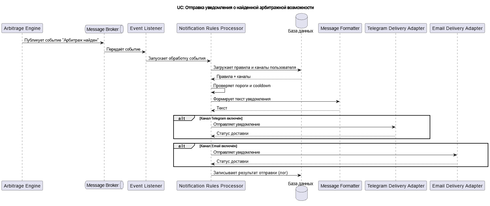
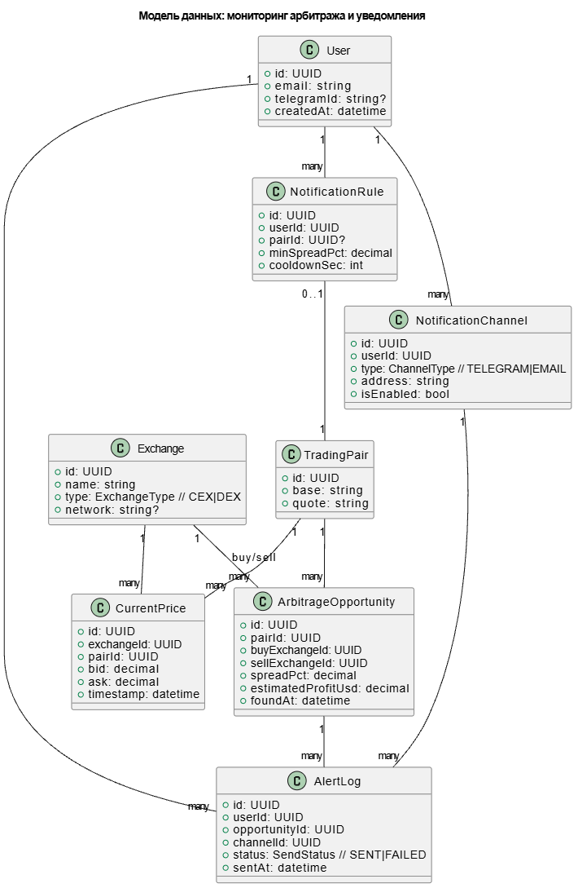

# Лабораторная работа №3  
## Тема: Использование принципов проектирования на уровне методов и классов 
## Проект: Информационная система для мониторинга арбитражных ситуаций между CEX и DEX  

**Цель работы:**  
Получить опыт проектирования и реализации модулей с использованием принципов KISS, YAGNI, DRY, SOLID и др.

---

## 1. Диаграмма контейнеров

Диаграмма: https://drive.google.com/file/d/1gL4OZ2n37HtsMcMM0nq80XcRVCPMSklY/view?usp=sharing

Пояснения к контейнерам находятся в ЛР№2

---

## 2. Диаграмма компонентов (Notifications Service)

Сервис уведомлений отвечает за обработку событий и доставку уведомлений пользователю.

Диаграмма: https://drive.google.com/file/d/1lvHrddS8DUIXVByelgqJfavJFiH0AWuC/view?usp=sharing

---

## 3. Диаграмма последовательностей

Arbitrage Engine
Обнаруживает арбитражную ситуацию (CEX ↔ DEX) и публикует событие «Арбитраж найден» в брокер сообщений.

Message Broker
Асинхронно доставляет событие в сервис уведомлений, обеспечивая слабую связанность между расчётом арбитража и отправкой уведомлений.

Event Listener
Подписывается на очередь/топик брокера, получает событие и инициирует обработку внутри Notifications Service.

Notification Rules Processor
Загружает настройки пользователя (правила и каналы), проверяет условия отправки: минимальный порог (спред/прибыль) и ограничение частоты отправки (cooldown).

База данных  
Хранит правила уведомлений и активные каналы пользователя; используется также для записи результата отправки.

Message Formatter 
Формирует текст уведомления по единому шаблону для Telegram и Email (без дублирования логики форматирования).

Telegram Delivery Adapter
Если Telegram-канал включён — отправляет сообщение через Telegram Bot API и возвращает статус доставки.

Email Delivery Adapter
Если Email-канал включён — отправляет письмо через SMTP/Email-провайдера и возвращает статус доставки.

Запись результата отправки (лог)  
После попытки отправки фиксируется результат (успех/ошибка) — для аудита, диагностики

---

## 4. Модель БД

---

## 5. Применение основных принципов разработки

Сервер: SOLID (DIP) — зависимость от абстракции
interface NotificationSender {
  send(to: string, message: string): Promise<void>;
}

DIP: доменная логика не зависит от Telegram напрямую, только от интерфейса.

Сервер: DRY — единый формат уведомления
class MessageFormatter {
  format(pair: string, spreadPct: number) {
    return `Арбитраж: ${pair}\nSpread: ${spreadPct.toFixed(2)}%`;
  }
}

DRY: текст уведомления формируется в одном месте.

Сервер: KISS + YAGNI — простая обработка события
class NotificationProcessor {
  constructor(private fmt: MessageFormatter, private sender: NotificationSender) {}

  async handle(to: string, pair: string, spreadPct: number, minSpreadPct: number) {
    if (spreadPct < minSpreadPct) return;          // KISS: ранний выход
    await this.sender.send(to, this.fmt.format(pair, spreadPct)); // YAGNI: без ретраев
  }
}

KISS: линейная логика “проверить → отправить”.
YAGNI: не добавляем сложные механизмы (ретраи/приоритеты), пока не требуется.

Клиент: DRY + KISS — один метод для запроса
export async function fetchOpportunities(minSpreadPct: number) {
  const res = await fetch(`/api/opportunities?minSpreadPct=${minSpreadPct}`);
  if (!res.ok) throw new Error("load failed");
  return res.json();
}

DRY: запрос описан один раз.
KISS: минимум абстракций.

Клиент: YAGNI — простой компонент без “лишнего”
import React from "react";
import { fetchOpportunities } from "./api";

export function OpportunitiesPage() {
  const [items, setItems] = React.useState<any[]>([]);
  React.useEffect(() => { fetchOpportunities(1.0).then(setItems); }, []);
  return <ul>{items.map(x => <li key={x.id}>{x.pair} {x.spreadPct}%</li>)}</ul>;
}