# Лабораторная работа №4 — Проектирование REST API
**Тема:** Проектирование REST API  
**Цель работы:** Получить опыт проектирования программного интерфейса.  
**Сервис:** `backend-api` проекта CEX/DEX parser MVP (FastAPI)

---

## 1. Принятые проектные решения (10)

1. **Разделение API по контекстам**: `auth`, `user`, `admin` (`/api/auth/*`, `/api/opportunities`, `/api/admin/*`).
2. **JWT-аутентификация**: после `POST /api/auth/login` клиент получает bearer token и использует его в `Authorization`.
3. **RBAC для админских операций**: endpoint в `/api/admin/*` доступны только пользователю с ролью `admin` (`403` при отсутствии прав).
4. **Единый формат обмена**: запросы/ответы в JSON, контракты зафиксированы Pydantic-моделями.
5. **UUID как идентификаторы доменных сущностей**: пары, сети, площадки, протоколы.
6. **Чтение через GET + query-параметры**: фильтрация и ограничения (`network`, `limit`, `kind`, `chain_kind`).
7. **Создание через POST**: отдельные endpoint для создания пар и сетей (`POST /api/admin/pairs`, `POST /api/admin/chains`).
8. **Мягкое удаление пары**: `DELETE /api/admin/pairs/{pair_id}` не удаляет запись физически, а ставит `is_enabled=false`.
9. **Частичное обновление через PATCH**: для `pairs/chains/settings` используется PATCH как более безопасный способ точечных изменений.
10. **Hot-reload конфигурации движка**: при изменениях в `pairs/chains/settings` увеличивается `settings.config_version`, что триггерит переинициализацию в `engine`.

---

## 2. Документация по API

OpenAPI: `http://173.249.63.17:8000/docs`

### Базовые форматы
- `Content-Type: application/json`
- `Authorization: Bearer <JWT>` для защищенных endpoint
- Даты: `ISO 8601`
- Ошибки: JSON с полем `detail`

### Реализованные endpoint (актуальные для проекта)

1. `POST /api/auth/login`  
Запрос:
```json
{
  "email": "admin@example.com",
  "password": "admin_password"
}
```
Ответ:
```json
{
  "access_token": "<jwt>",
  "token_type": "bearer",
  "expires_in": 3600
}
```

2. `GET /api/auth/me`  
Возвращает профиль текущего пользователя:
```json
{
  "id": "uuid",
  "email": "admin@example.com",
  "role": "admin",
  "is_active": true,
  "created_at": "2026-02-25T10:00:00Z"
}
```

3. `GET /api/opportunities?network=base&limit=5`  
Возвращает массив возможностей:
```json
[
  {
    "id": "uuid",
    "pair_id": "uuid",
    "symbol": "CLAWNCH/USDT",
    "network": "base",
    "cex_price": 0.123,
    "dex_price": 0.118,
    "spread_pct": 4.23,
    "detected_at": "2026-02-25T10:05:00Z"
  }
]
```

4. `GET /api/admin/pairs`  
Список конфигураций торговых пар (только admin).

5. `POST /api/admin/pairs`  
Создание пары (только admin). Пример запроса:
```json
{
  "symbol": "TEST/USDT",
  "network": "base",
  "cex_venue_id": "10000000-0000-0000-0000-000000000001",
  "cex_symbol": "TESTUSDT",
  "dex_venue_id": "10000000-0000-0000-0000-000000000002",
  "protocol_id": "40000000-0000-0000-0000-000000000002",
  "pool_address": "0x1111111111111111111111111111111111111111",
  "meta": {
    "source": "lab4"
  }
}
```

6. `DELETE /api/admin/pairs/{pair_id}`  
Soft-delete пары, ответ:
```json
{
  "ok": true
}
```

Дополнительно реализованы:  
- `GET /api/admin/settings`, `PATCH /api/admin/settings`  
- `GET/POST/PATCH /api/admin/chains`  
- `GET /api/admin/venues`  
- `GET /api/admin/protocols`  
- `GET /api/admin/capabilities`  
- `GET /api/admin/health/chains`  
- `POST /api/admin/pairs/validate`

Примечание: в текущей версии проекта метод `PUT` не используется, обновления сделаны через `PATCH`.

---

## 3. Тестирование API

Тестирование выполняется в Postman.

В переменные окружения были добавлены следующие значения:

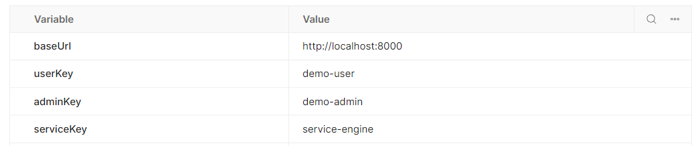

---

### 01 Health-check

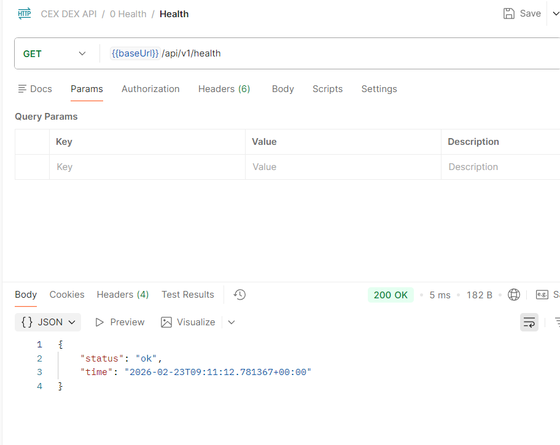

---

### 02 Exchange — пользователь получает список

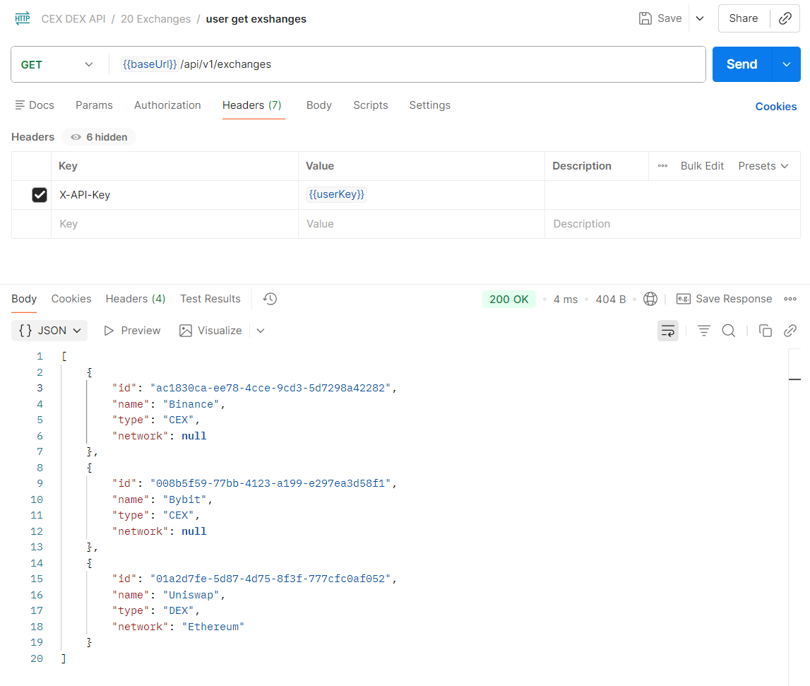

---

### 03 Exchange — пользователь пытается создать (403)


---

### 04 Exchange — администратор создаёт биржу (201)

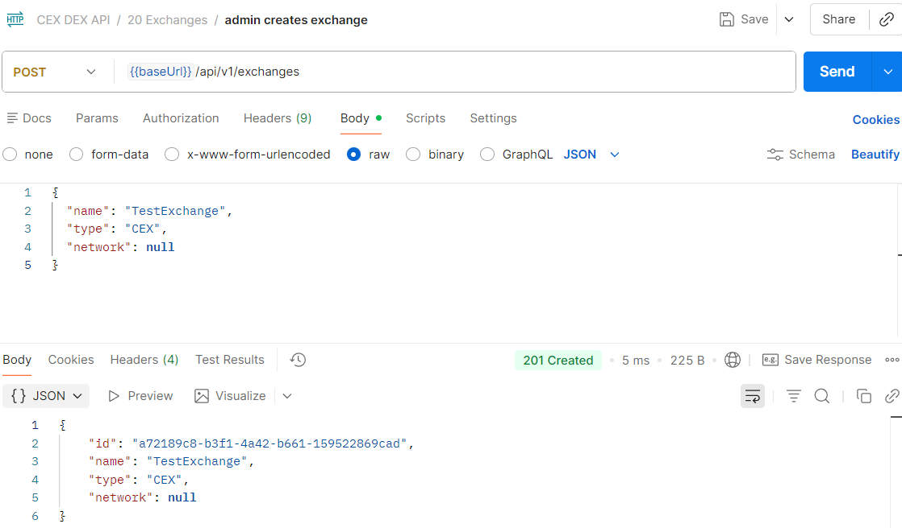

---

### 05 Pairs — администратор создаёт торговую пару

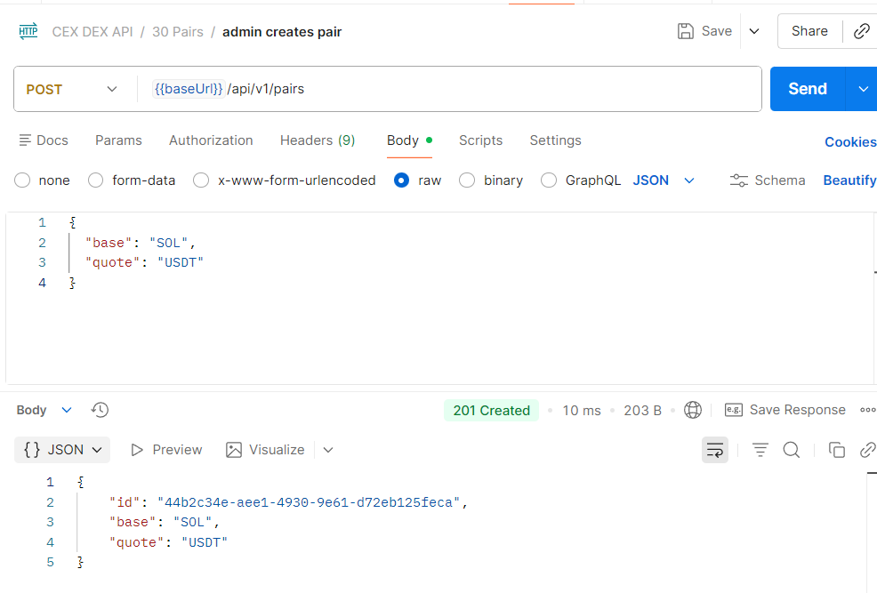

---

### 06 Pairs — пользователь получает список

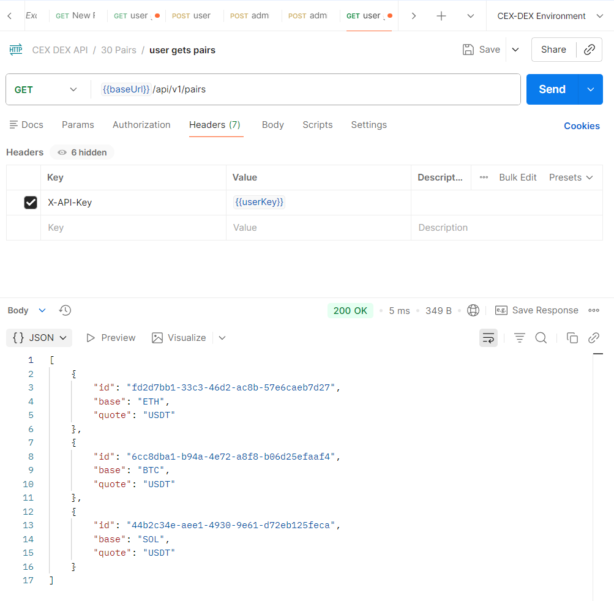

---

### 07 Internal — сервис создаёт котировку

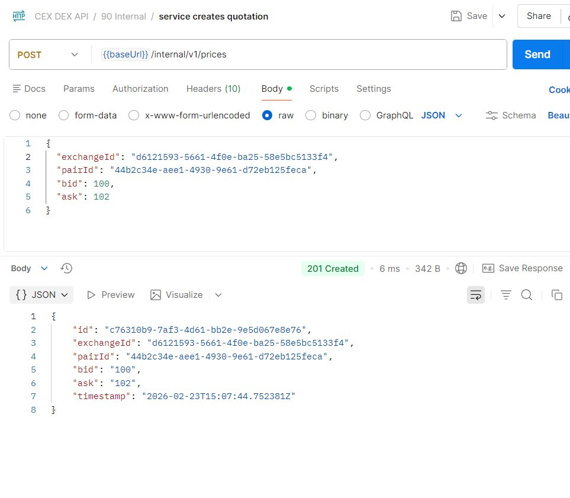

---

### 08 Internal — пользователь пытается вызвать сервисный endpoint (403)

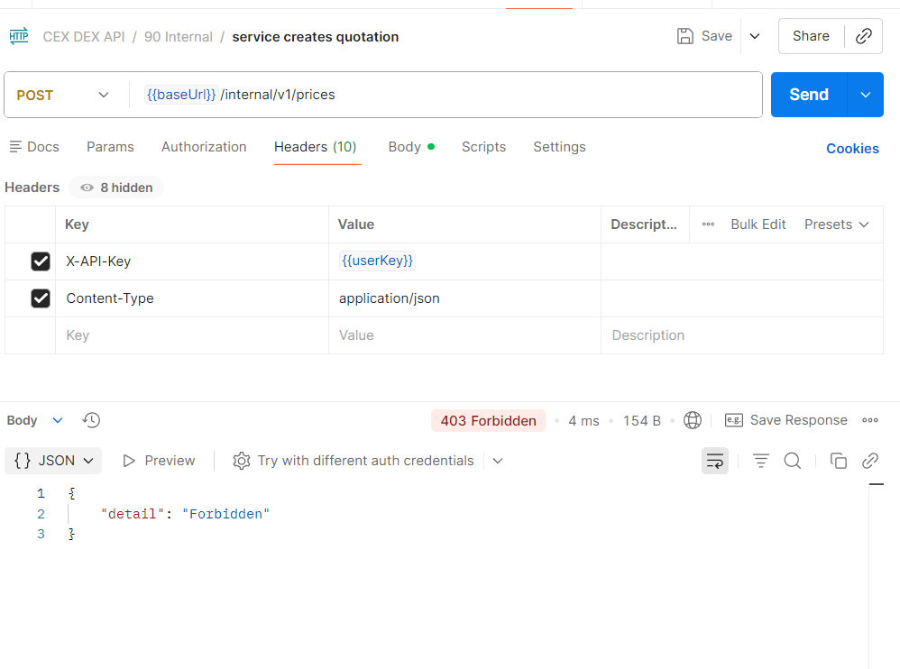

---

### 09 Opportunities — сервис создаёт арбитражную возможность

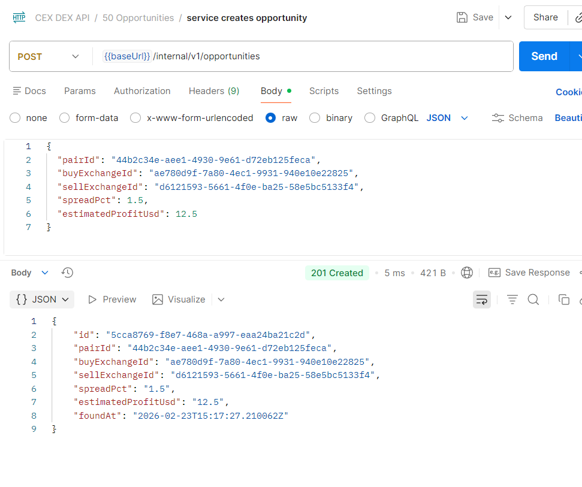

---

### 10 Opportunities — пользователь получает список

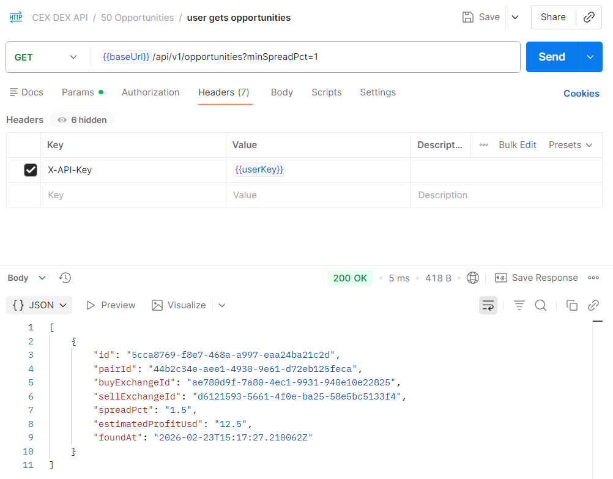

---

### 11 Notification Channel — пользователь создаёт канал

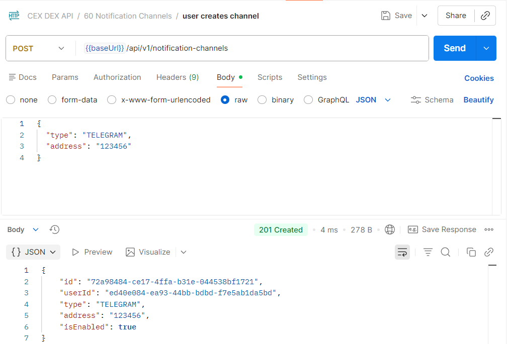

---

### 12 Notification Rule — пользователь создаёт правило

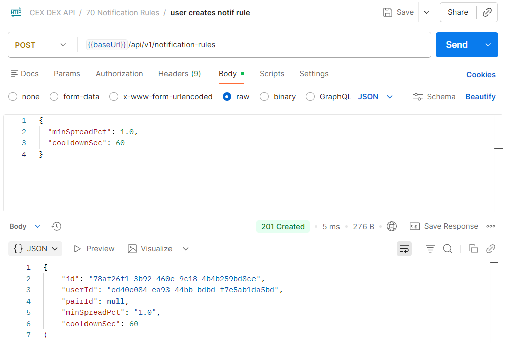

---

## 4. Что реализовано

- Реализованы методы **GET/POST/DELETE** и **PATCH** (частичное обновление)  
- Реализована JWT-аутентификация и разграничение ролей (`user`/`admin`)  
- Реализована фильтрация, валидация параметров и единый формат ошибок  
- Реализован админский контур управления конфигурацией (`pairs/chains/settings`)  
- Реализована проверка конфигурации пары через `POST /api/admin/pairs/validate`  
- Реализован soft-delete пар и версия конфигурации для hot-reload движка  
