# Лабораторная работа №6

## Тема

Использование шаблонов проектирования.

## Цель работы

Получить опыт применения шаблонов проектирования GoF при разработке программной системы.


## Кратко о проекте

Исследуемый проект представляет собой многосервисную систему для поиска арбитражных возможностей между CEX и DEX. В репозитории есть:

- `engine` для получения цен с CEX/DEX и расчета сигналов;
- `backend-api` для администрирования и API;
- модули для EVM и Solana-источников цен;
- REST и WebSocket-источники данных.

Ниже рассмотрены шаблоны проектирования, которые уже реализованы в существующем коде проекта.

## Шаблоны проектирования GoF

### Порождающие шаблоны

#### 1. Factory Method: создание chain-specific pricer

**Общее назначение.**  
Factory Method инкапсулирует создание объектов и убирает прямую зависимость клиентского кода от конкретных классов.

**Назначение в проекте.**  
В проекте функция `create_chain_dex_pricer(...)` создает подходящий объект для чтения DEX-цены в зависимости от типа сети: `BaseDexRpcPricer` для EVM и `SolanaPricer` для Solana. Внешний код работает через интерфейс `IChainDexPricer`.

**Ключевые файлы.**

- `services/engine/price_sources/dex/common/pricer_factory.py`
- `services/engine/price_sources/dex/common/pricer.py`
- `services/engine/price_sources/dex/evm/rpc/base_price.py`
- `services/engine/price_sources/dex/solana/rpc/pricer.py`

**UML-диаграмма.**

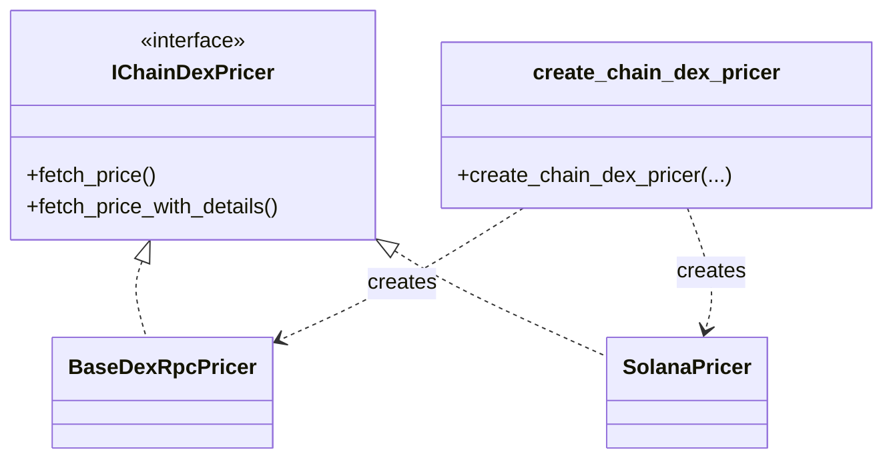

**Фрагмент кода.**

```python
def create_chain_dex_pricer(... ) -> IChainDexPricer:
    normalized_kind = (chain_kind or "").strip().lower()
    if normalized_kind == "evm":
        from ..evm.rpc.base_price import BaseDexRpcPricer
        return BaseDexRpcPricer(...)

    if normalized_kind == "solana":
        from ..solana.rpc.pricer import SolanaPricer
        return SolanaPricer(...)

    raise ValueError(f"Unsupported chain kind: {chain_kind}")
```

**Что это дает проекту.**

- упрощает добавление новых сетей;
- изолирует код создания pricer от основного цикла `engine`;
- позволяет тестировать фабрику отдельно.

---

#### 2. Factory Method: создание DEX source

**Общее назначение.**  
Шаблон позволяет централизованно создавать объекты одного семейства, скрывая детали выбора конкретной реализации.

**Назначение в проекте.**  
Функция `create_dex_source(...)` возвращает `EvmDexSource` или `SolanaDexSource` в зависимости от `chain_cfg.type`. Клиент получает единый контракт `DexPriceSource`.

**Ключевые файлы.**

- `services/engine/price_sources/dex/common/factory.py`
- `services/engine/price_sources/dex/common/base.py`
- `services/engine/price_sources/dex/evm/protocols/pools.py`
- `services/engine/price_sources/dex/solana/protocols/amm.py`

**UML-диаграмма.**

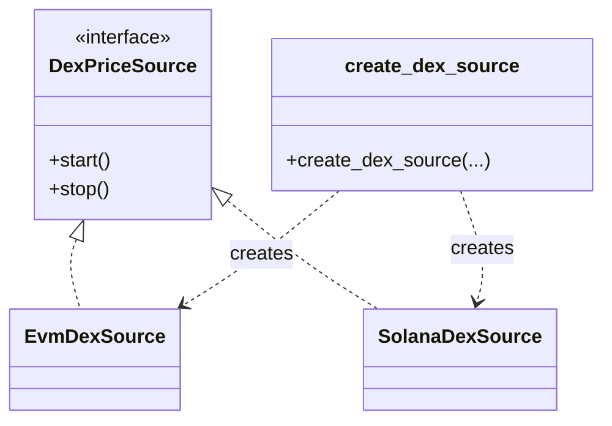

**Фрагмент кода.**

```python
def create_dex_source(... ) -> DexPriceSource | None:
    chain_type = (chain_cfg.type or "").lower()
    if chain_type == "evm":
        return EvmDexSource(...)

    if chain_type == "solana":
        return SolanaDexSource(...)

    raise ValueError(f"Unsupported chain type: {chain_cfg.type}")
```

**Что это дает проекту.**

- упрощает конфигурацию источников;
- отделяет orchestration-код от конкретных реализаций;
- делает архитектуру расширяемой.

---

#### 3. Abstract Factory: семейство декодеров Solana pool parser

**Общее назначение.**  
Abstract Factory создает семейства взаимосвязанных объектов без жесткой привязки клиента к конкретным классам.

**Назначение в проекте.**  
`SolanaPoolParser` работает с реестром декодеров разных протоколов: `OrcaClmmDecoder`, `RaydiumClmmDecoder`, `MeteoraDlmmDecoder`, `PumpAmmDecoder` и т.д. Клиент parser не зависит от конкретного декодера: он получает нужный объект по `program_id`.

**Ключевые файлы.**

- `services/engine/price_sources/dex/solana/rpc/pool_parser.py`
- `services/engine/price_sources/dex/solana/rpc/decoders/*.py`

**UML-диаграмма.**

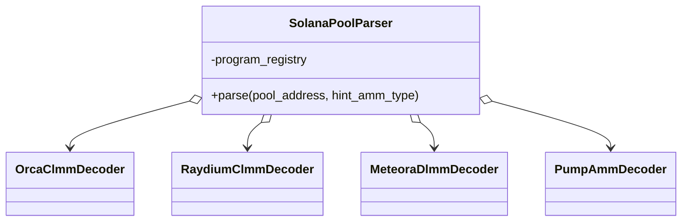

**Фрагмент кода.**

```python
default_registry: dict[str, Any] = {
    ORCA_WHIRLPOOL_PROGRAM_ID: OrcaClmmDecoder(),
    RAYDIUM_CLMM_PROGRAM_ID: RaydiumClmmDecoder(),
    METEORA_DLMM_PROGRAM_ID: MeteoraDlmmDecoder(),
    PUMP_AMM_PROGRAM_ID: PumpAmmDecoder(),
}

decoder = self._program_registry.get(owner_program)
partial_meta = dict(decoder.decode(pool_data))
```

**Что это дает проекту.**

- упрощает поддержку нескольких Solana-протоколов;
- позволяет добавлять новый decoder без переписывания parser-клиента;
- уменьшает связанность между RPC-слоем и протокольной логикой.

### Структурные шаблоны

#### 4. Adapter: совместимость старого вызова DexscreenerSource

**Общее назначение.**  
Adapter преобразует один интерфейс в другой, ожидаемый клиентом.

**Назначение в проекте.**  
`DexscreenerSource` является адаптером над `DexscreenerRestSource`. Он принимает старый формат вызова `cfg`, раскладывает параметры и передает их в базовую реализацию. Это позволяет не переписывать клиентский код, ожидающий `DexscreenerSource(event_bus=..., cfg=...)`.

**Ключевые файлы.**

- `services/engine/price_sources/dex/rest/dexscreener/source.py`

**UML-диаграмма.**

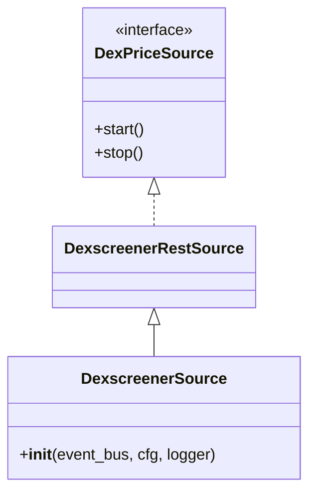

**Фрагмент кода.**

```python
class DexscreenerSource(DexscreenerRestSource):
    def __init__(self, *, event_bus: EventBus, cfg: dict, logger=None) -> None:
        cfg = dict(cfg or {})
        csv_path = cfg.get("csv_path") or default_csv
        poll_interval_ms = int(cfg.get("poll_interval_ms", 3000))
        super().__init__(
            event_bus=event_bus,
            csv_path=csv_path,
            poll_interval_ms=poll_interval_ms,
            ...
        )
```

**Что это дает проекту.**

- сохраняет обратную совместимость;
- локализует преобразование конфигурации;
- снижает цену рефакторинга.

---

#### 5. Bridge: разделение абстракции pricer и реализаций по chain

**Общее назначение.**  
Bridge разделяет абстракцию и реализацию, чтобы они могли изменяться независимо.

**Назначение в проекте.**  
Абстракция `IChainDexPricer` задает единый контракт получения цены, а реализации `BaseDexRpcPricer` и `SolanaPricer` содержат специфичную для chain логику. Код `engine` работает с абстракцией, а не с конкретным классом.

**Ключевые файлы.**

- `services/engine/price_sources/dex/common/pricer.py`
- `services/engine/price_sources/dex/evm/rpc/base_price.py`
- `services/engine/price_sources/dex/solana/rpc/pricer.py`

**UML-диаграмма.**

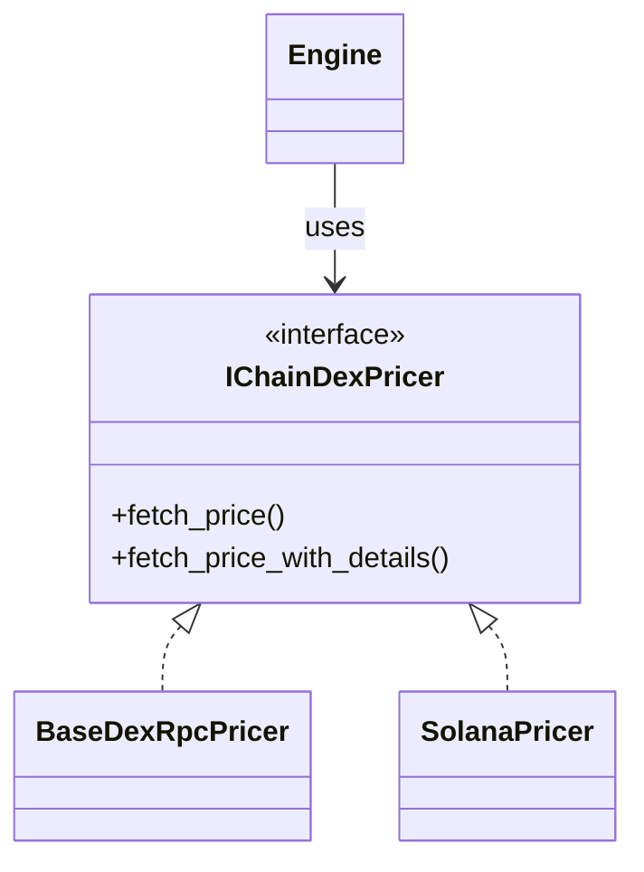

**Фрагмент кода.**

```python
class IChainDexPricer(ABC):
    @abstractmethod
    def fetch_price(self, prefer_ws: bool = False) -> float:
        ...

    @abstractmethod
    def fetch_price_with_details(self, prefer_ws: bool = False) -> tuple[float, dict[str, object]]:
        ...
```

**Что это дает проекту.**

- позволяет развивать EVM и Solana-логику независимо;
- уменьшает число `if/else` в коде верхнего уровня;
- делает систему удобной для замены реализации.

---

#### 6. Facade: SolanaPoolParser скрывает сложный RPC/decoder pipeline

**Общее назначение.**  
Facade предоставляет простой интерфейс к сложной подсистеме.

**Назначение в проекте.**  
`SolanaPoolParser` инкапсулирует несколько низкоуровневых шагов: чтение account info, выбор decoder, разбор mint/vault, проверку совместимости и сбор итогового `meta`. Для клиента это один вызов `parse(pool_address)`.

**Ключевые файлы.**

- `services/engine/price_sources/dex/solana/rpc/pool_parser.py`

**UML-диаграмма.**

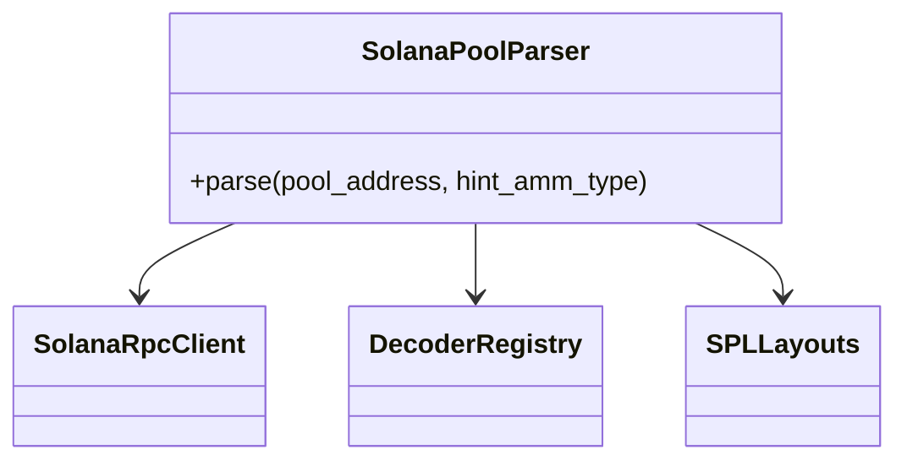

**Фрагмент кода.**

```python
def parse(self, pool_address: str, hint_amm_type: str | None = None) -> dict[str, Any]:
    pool_account = self._rpc_client.get_account_info(pool_address, encoding="base64")
    decoder = self._program_registry.get(owner_program)
    partial_meta = dict(decoder.decode(pool_data))
    accounts = self._rpc_client.get_multiple_accounts([...], encoding="base64")
    return {
        "amm_type": amm_type,
        "base_vault": base_vault_key,
        "quote_vault": quote_vault_key,
        ...
    }
```

**Что это дает проекту.**

- скрывает низкоуровневую сложность;
- делает API parser компактным;
- облегчает автодетект Solana-пулов.

---

#### 7. Flyweight: кеш pricer-объектов в engine

**Общее назначение.**  
Flyweight переиспользует уже созданные объекты, если у них есть общее внутреннее состояние, чтобы экономить ресурсы.

**Назначение в проекте.**  
Функция `get_or_create_chain_dex_pricer(...)` не создает новый pricer для каждой итерации цикла `engine`, а возвращает объект из кеша `dex_clients`. Это особенно важно для RPC-клиентов и связанных структур.

**Ключевые файлы.**

- `services/engine/app.py`
- `services/engine/tests/test_engine_pricer_smoke.py`

**UML-диаграмма.**

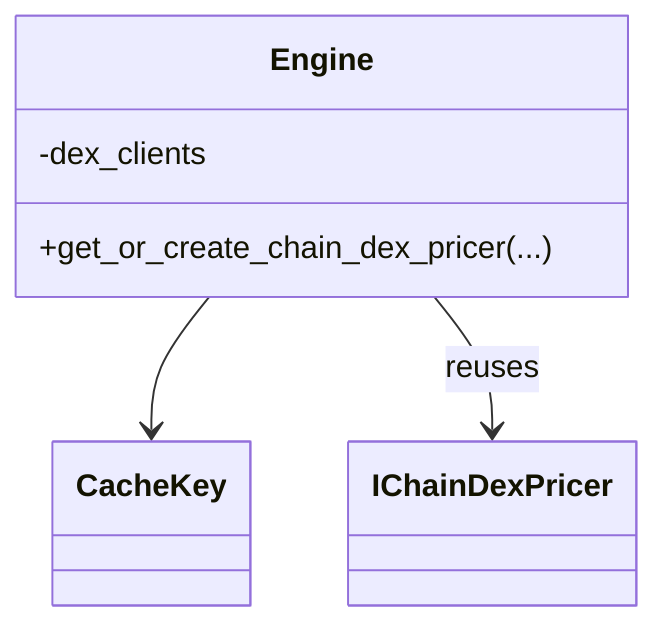

**Фрагмент кода.**

```python
def get_or_create_chain_dex_pricer(... ) -> IChainDexPricer:
    dex_key = _build_dex_cache_key(pair)
    dex = dex_clients.get(dex_key)
    if dex is not None:
        return dex

    dex = create_chain_dex_pricer(...)
    dex_clients[dex_key] = dex
    return dex
```

**Что это дает проекту.**

- сокращает число повторных инициализаций;
- снижает нагрузку на сеть и память;
- стабилизирует время работы основного цикла.

---

#### 8. Proxy: доступ к Dexscreener через пул прокси

**Общее назначение.**  
Proxy подставляет промежуточный объект между клиентом и реальным сервисом, контролируя доступ к нему.

**Назначение в проекте.**  
Для `DexscreenerClient` можно задать `ProxyPool`, который выдает очередной HTTP proxy. В результате прямой доступ к внешнему API заменяется управляемым доступом через промежуточный слой.

**Ключевые файлы.**

- `services/engine/price_sources/dex/rest/dexscreener/client.py`
- `services/engine/price_sources/dex/rest/dexscreener/proxy_pool.py`

**UML-диаграмма.**

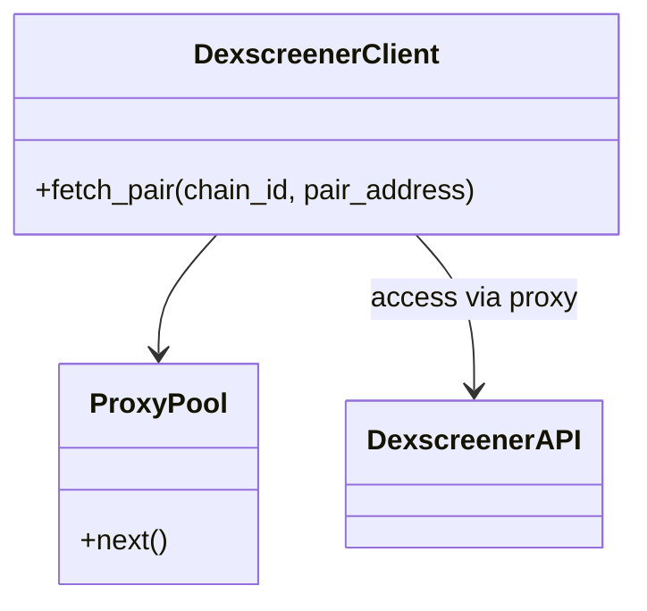

**Фрагмент кода.**

```python
proxies = self._proxy_pool.next() if self._proxy_pool else None
response = self._session.get(
    url,
    timeout=self._timeout,
    headers=headers,
    proxies=proxies,
)
```

**Что это дает проекту.**

- управляет доступом к внешнему API;
- позволяет масштабировать REST-опрос;
- снижает риск блокировок и rate-limit проблем.

### Поведенческие шаблоны

#### 9. Strategy: выбор алгоритма расчета цены в SolanaPricer

**Общее назначение.**  
Strategy выносит набор взаимозаменяемых алгоритмов в отдельные ветви поведения, которые можно выбирать во время выполнения.

**Назначение в проекте.**  
`SolanaPricer.fetch_price_with_details(...)` выбирает алгоритм расчета цены по `amm_type`: через балансы vault, через `sqrt_price`, через `active_bin`, через Meteora AMM vault totals и т.д.

**Ключевые файлы.**

- `services/engine/price_sources/dex/solana/rpc/pricer.py`

**UML-диаграмма.**

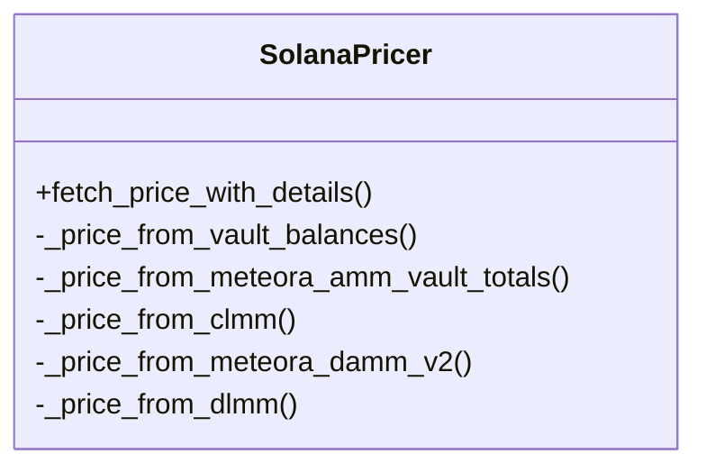

**Фрагмент кода.**

```python
if amm_type in {"raydium_amm", "raydium_cpmm", "pump_amm"}:
    return self._price_from_vault_balances(cfg)
if amm_type == "meteora_damm_v2":
    return self._price_from_meteora_damm_v2(cfg)
if amm_type == "meteora_amm":
    return self._price_from_meteora_amm_vault_totals(cfg)
if amm_type in {"orca_clmm", "raydium_clmm"}:
    return self._price_from_clmm(cfg)
if amm_type == "meteora_dlmm":
    return self._price_from_dlmm(cfg)
```

**Что это дает проекту.**

- позволяет поддерживать несколько моделей ценообразования;
- упрощает расширение списка протоколов;
- делает код расчета более изолированным и тестируемым.

---

#### 10. Strategy: выбор decoder по типу Solana-протокола

**Общее назначение.**  
Strategy позволяет выбирать конкретный алгоритм обработки данных в зависимости от контекста.

**Назначение в проекте.**  
В `SolanaPoolParser` конкретный decoder выбирается из реестра по `owner_program`. Каждый decoder реализует свою стратегию декодирования состояния пула.

**Ключевые файлы.**

- `services/engine/price_sources/dex/solana/rpc/pool_parser.py`
- `services/engine/price_sources/dex/solana/rpc/decoders/*.py`

**UML-диаграмма.**

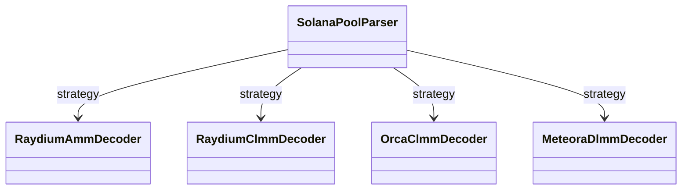

**Фрагмент кода.**

```python
decoder = self._program_registry.get(owner_program)
if decoder is None:
    raise UnsupportedPoolProgram(...)

partial_meta = dict(decoder.decode(pool_data))
```

**Что это дает проекту.**

- убирает гигантский `if/elif` по протоколам;
- делает декодеры независимыми;
- упрощает добавление нового протокола.

---

#### 11. Observer: подписки на обновления в SolanaWsClient

**Общее назначение.**  
Observer организует модель публикации и подписки: одни объекты рассылают события, другие реагируют на них.

**Назначение в проекте.**  
`SolanaWsClient` хранит набор callback-функций по `pubkey` и вызывает их при получении `accountNotification`. Компоненты, которым нужны обновления аккаунтов, подписываются через `update_subscriptions(...)`.

**Ключевые файлы.**

- `services/engine/price_sources/dex/solana/ws_client.py`
- `services/engine/tests/test_solana_ws_client.py`

**UML-диаграмма.**

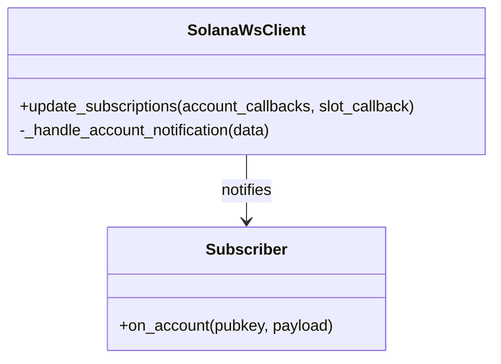

**Фрагмент кода.**

```python
async def update_subscriptions(self, account_callbacks, slot_callback=None) -> None:
    self._account_callbacks = dict(account_callbacks)
    self._slot_callback = slot_callback

def _handle_account_notification(self, data: dict[str, Any]) -> None:
    pubkey = self._subscription_to_pubkey.get(int(sub_id))
    callback = self._account_callbacks.get(pubkey)
    if callback is not None:
        callback(pubkey, payload)
```

**Что это дает проекту.**

- ослабляет связь между WebSocket-клиентом и обработчиками;
- позволяет динамически менять подписчиков;
- удобно тестируется через фейковые callbacks.

---

#### 12. State: управление жизненным циклом соединения в ChainWsMonitor

**Общее назначение.**  
State позволяет объекту менять поведение в зависимости от текущего состояния.

**Назначение в проекте.**  
`ChainWsMonitor` хранит состояние WebSocket-подключения: `_connected`, `_subscription_id`, `_last_error`, `_last_event_ts`. Поведение `is_live()`, `start()`, `stop()` и реакций на `_on_open/_on_error/_on_close` зависит от текущего состояния соединения.

**Ключевые файлы.**

- `services/engine/app.py`

**UML-диаграмма.**

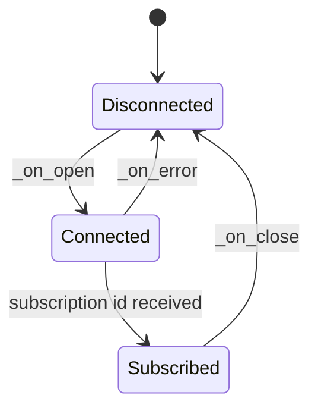

**Фрагмент кода.**

```python
def _on_open(self, ws) -> None:
    with self._lock:
        self._connected = True
        self._subscription_id = None
        self._last_error = ""

def _on_error(self, _ws, error) -> None:
    with self._lock:
        self._connected = False
        self._last_error = str(error)
```

**Что это дает проекту.**

- делает поведение monitor предсказуемым;
- упрощает reconnection-логику;
- дает прозрачную диагностику состояния канала.

---

#### 13. Mediator: координация компонентов внутри SolanaWsMonitor

**Общее назначение.**  
Mediator централизует взаимодействие между несколькими объектами, чтобы они не ссылались друг на друга напрямую.

**Назначение в проекте.**  
`SolanaWsMonitor` координирует `SolanaWsClient`, `pricer_resolver`, карту подписок, debounce-очередь и `sink`. Компоненты не общаются друг с другом напрямую: все их взаимодействие проходит через monitor.

**Ключевые файлы.**

- `services/engine/price_sources/dex/solana/ws_monitor.py`
- `services/engine/tests/test_solana_ws_monitor.py`

**UML-диаграмма.**

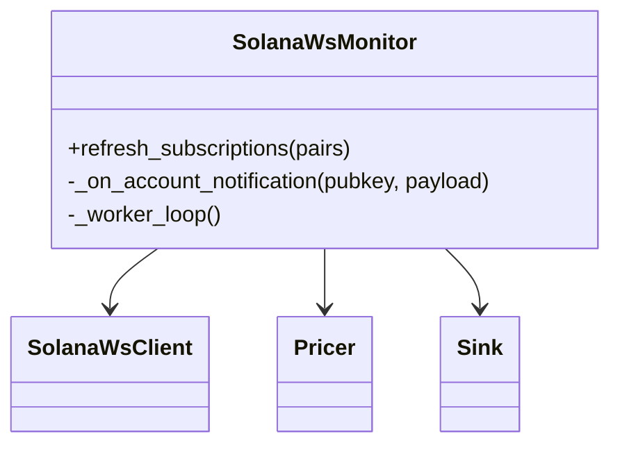

**Фрагмент кода.**

```python
def refresh_subscriptions(self, pairs: list[PairLike]) -> None:
    for pair in pairs:
        pricer = self._pricer_resolver(pair)
        watch_accounts = pricer.get_watch_accounts()
        ...

async def _worker_loop(self) -> None:
    for pair_id in pending:
        pair = self._pairs_by_id.get(pair_id)
        pricer = self._pricer_resolver(pair)
        price, details = pricer.fetch_price_with_details(prefer_ws=True)
        self._sink(pair_id, price, details, time.time())
```

**Что это дает проекту.**

- уменьшает связанность между WS-клиентом и pricer-логикой;
- централизует debounce и перепрайсинг;
- упрощает дальнейшее развитие Solana streaming-подсистемы.

## Вывод

В существующем проекте уже реализован заметный набор шаблонов GoF, причем они используются не формально, а в рабочих подсистемах:

- фабрики управляют созданием pricer/source;
- фасад и абстрактная фабрика упрощают работу с Solana-пулами;
- мост и адаптер помогают держать единый API для разных источников;
- стратегии, observer, state и mediator обеспечивают гибкую обработку рыночных данных.

Таким образом, цель лабораторной работы достигнута: в проекте выявлены и проанализированы шаблоны GoF, сопровожденные UML-диаграммами и фрагментами реального кода.

## Ссылки на использованный код

- [services/engine/price_sources/dex/common/pricer_factory.py](/c:/Users/aksma/OneDrive/Рабочий%20стол/cex%20trade%20tools/cex%20dex%20parser%20mvp%20(24.02.26=last)/services/engine/price_sources/dex/common/pricer_factory.py)
- [services/engine/price_sources/dex/common/factory.py](/c:/Users/aksma/OneDrive/Рабочий%20стол/cex%20trade%20tools/cex%20dex%20parser%20mvp%20(24.02.26=last)/services/engine/price_sources/dex/common/factory.py)
- [services/engine/price_sources/dex/common/pricer.py](/c:/Users/aksma/OneDrive/Рабочий%20стол/cex%20trade%20tools/cex%20dex%20parser%20mvp%20(24.02.26=last)/services/engine/price_sources/dex/common/pricer.py)
- [services/engine/price_sources/dex/common/base.py](/c:/Users/aksma/OneDrive/Рабочий%20стол/cex%20trade%20tools/cex%20dex%20parser%20mvp%20(24.02.26=last)/services/engine/price_sources/dex/common/base.py)
- [services/engine/price_sources/dex/evm/protocols/pools.py](/c:/Users/aksma/OneDrive/Рабочий%20стол/cex%20trade%20tools/cex%20dex%20parser%20mvp%20(24.02.26=last)/services/engine/price_sources/dex/evm/protocols/pools.py)
- [services/engine/price_sources/dex/evm/rpc/base_price.py](/c:/Users/aksma/OneDrive/Рабочий%20стол/cex%20trade%20tools/cex%20dex%20parser%20mvp%20(24.02.26=last)/services/engine/price_sources/dex/evm/rpc/base_price.py)
- [services/engine/price_sources/dex/solana/protocols/amm.py](/c:/Users/aksma/OneDrive/Рабочий%20стол/cex%20trade%20tools/cex%20dex%20parser%20mvp%20(24.02.26=last)/services/engine/price_sources/dex/solana/protocols/amm.py)
- [services/engine/price_sources/dex/solana/rpc/pool_parser.py](/c:/Users/aksma/OneDrive/Рабочий%20стол/cex%20trade%20tools/cex%20dex%20parser%20mvp%20(24.02.26=last)/services/engine/price_sources/dex/solana/rpc/pool_parser.py)
- [services/engine/price_sources/dex/solana/rpc/pricer.py](/c:/Users/aksma/OneDrive/Рабочий%20стол/cex%20trade%20tools/cex%20dex%20parser%20mvp%20(24.02.26=last)/services/engine/price_sources/dex/solana/rpc/pricer.py)
- [services/engine/price_sources/dex/solana/ws_client.py](/c:/Users/aksma/OneDrive/Рабочий%20стол/cex%20trade%20tools/cex%20dex%20parser%20mvp%20(24.02.26=last)/services/engine/price_sources/dex/solana/ws_client.py)
- [services/engine/price_sources/dex/solana/ws_monitor.py](/c:/Users/aksma/OneDrive/Рабочий%20стол/cex%20trade%20tools/cex%20dex%20parser%20mvp%20(24.02.26=last)/services/engine/price_sources/dex/solana/ws_monitor.py)
- [services/engine/price_sources/dex/rest/dexscreener/source.py](/c:/Users/aksma/OneDrive/Рабочий%20стол/cex%20trade%20tools/cex%20dex%20parser%20mvp%20(24.02.26=last)/services/engine/price_sources/dex/rest/dexscreener/source.py)
- [services/engine/price_sources/dex/rest/dexscreener/client.py](/c:/Users/aksma/OneDrive/Рабочий%20стол/cex%20trade%20tools/cex%20dex%20parser%20mvp%20(24.02.26=last)/services/engine/price_sources/dex/rest/dexscreener/client.py)
- [services/engine/price_sources/dex/rest/dexscreener/proxy_pool.py](/c:/Users/aksma/OneDrive/Рабочий%20стол/cex%20trade%20tools/cex%20dex%20parser%20mvp%20(24.02.26=last)/services/engine/price_sources/dex/rest/dexscreener/proxy_pool.py)
- [services/engine/app.py](/c:/Users/aksma/OneDrive/Рабочий%20стол/cex%20trade%20tools/cex%20dex%20parser%20mvp%20(24.02.26=last)/services/engine/app.py)
